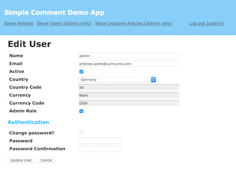

# Simple Comment Demo App - sc

This is a demo project to cover some tasks. Users can read and modify articles and comments, depending on their rights.

### Configuration / Before you start the app
#### Redis and Memchached
You will need memcached and redis on your system. Make sure its installed, get more info here:

Mac:

https://www.hacksparrow.com/install-memcached-on-mac-os-x.html

http://jasdeep.ca/2012/05/installing-redis-on-mac-os-x/

Ubuntu:

https://www.digitalocean.com/community/tutorials/how-to-install-and-use-memcache-on-ubuntu-14-04

https://wiki.ubuntuusers.de/Redis/

#### Set up the database
Go to sc project directory and use rake db:reset to setup the sqlite database and seed it with some init data.

```
MBP:sc user$ rake db:reset
MBP:sc user$ rake db:reset RAILS_ENV=production 
.
seed finished!
```

Then precompile the assets for production mode:

```
MBP:sc user$ rake assets:precompile
```

### Starting redis and memcached
Go to sc project directory and start foreman for memcached and redis support (session).
```
MBP:sc user$ foreman start
01:32:54 memcached.1 | started with pid 7544
01:32:54 redis.1     | started with pid 7545
```

### Starting the app
Start the server with rails s and open your browser with 'http://127.0.0.1:3000'
```
MBP:sc user$ rails s -b 0.0.0.0 -p 3000 -e production
.
Puma starting in single mode....
.
* Environment: production
* Listening on tcp://0.0.0.0:3000
Use Ctrl-C to stop
```

### Manual
#### Guest (not logged in)
As a guest you can only read articles and comments, but never change anything.

#### Login
By default you can login as 'admin' with password 'sumcumo' or normal 'user' with password 'sumcumo'.

**Note: user 'admin' can never be deleted, its role changed or be edited by someone else**

#### Admin
An admin has role 'admin' which allows him to edit and delete everything except items from user 'admin' itself (master admin).

#### User
A user can write articles and comments, and modify his own articles and comments.

## Tests
The app contains RSpec test. They can be called from the app directory as follows:

```
MBP:sc user$ rspec spec
.
Finished in 1.34 seconds (files took 1.88 seconds to load)
67 examples, 0 failures
```

Screenshots





